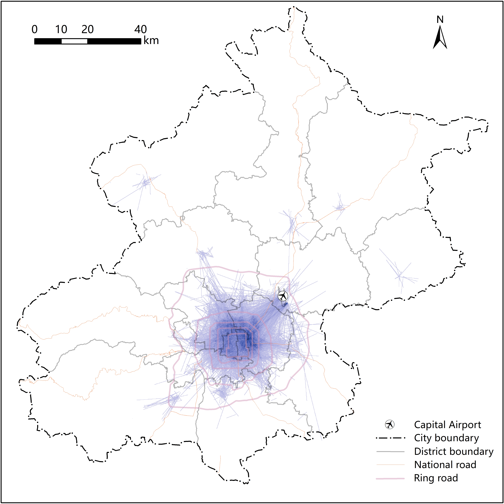
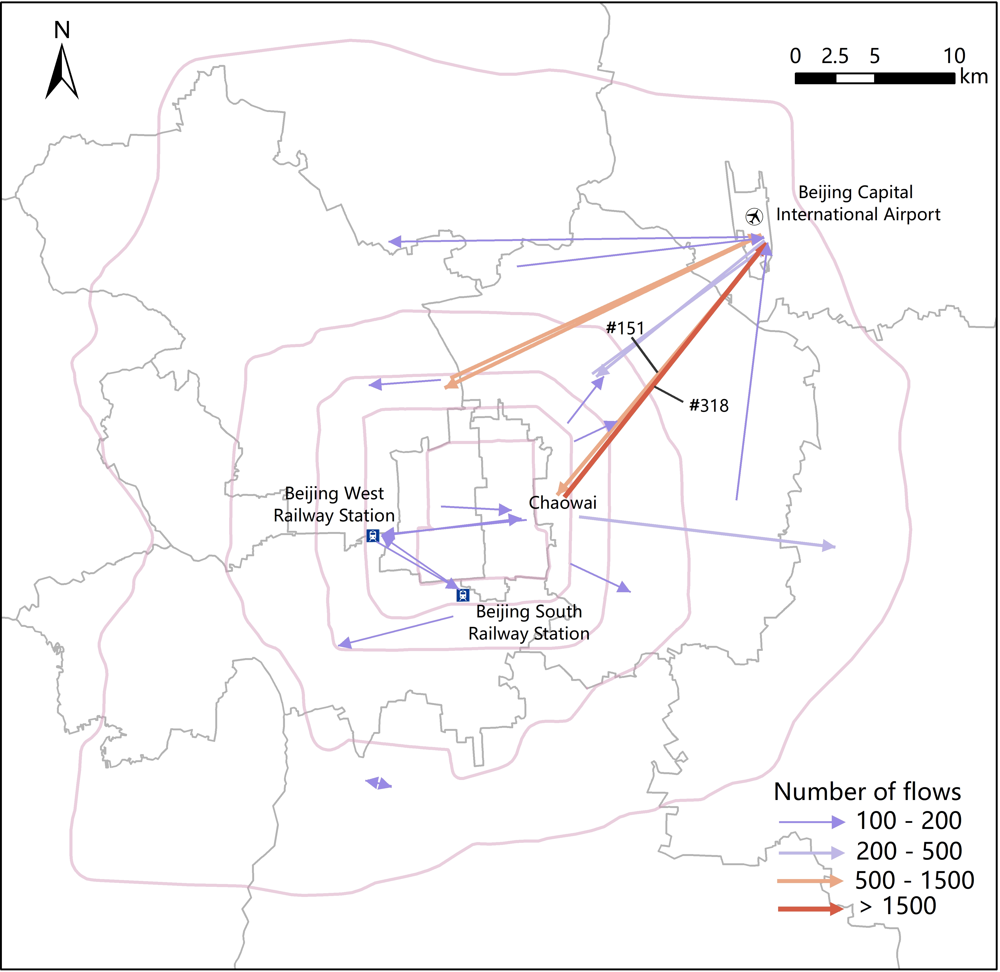
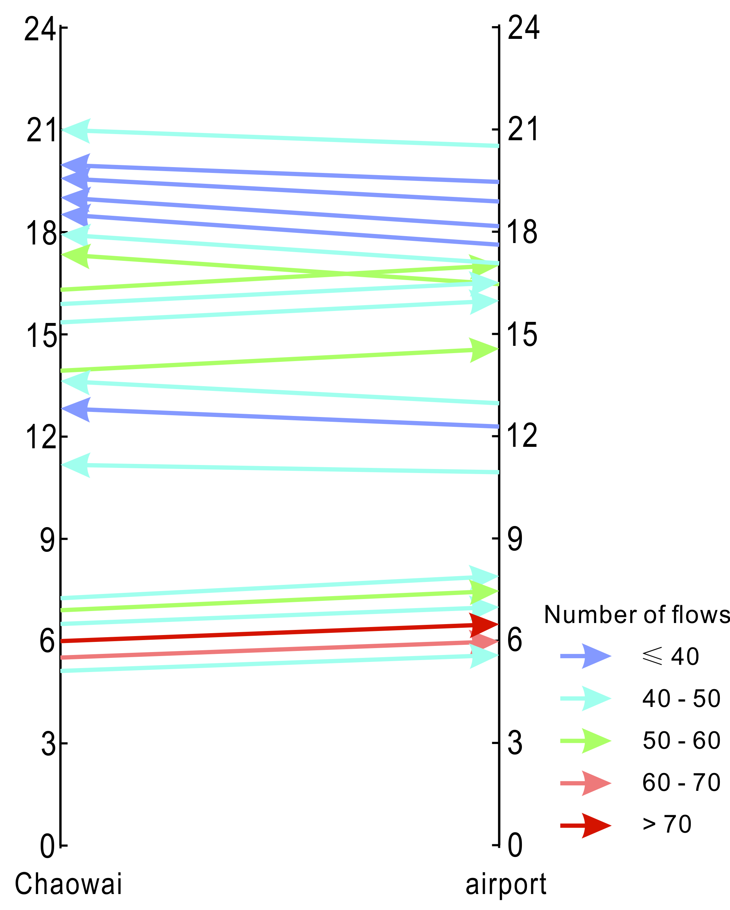

# flow-clustering

## Description
Flow clustering, which summarizes individual flows into aggregate flows, can help to discover human mobility patterns. Existing flow clustering methods ignore the geometric properties of flows and do not consider their temporal information. This research 
1. Defines new measurements of spatial similarity and temporal similarity between flows. 
2. Develops a spatio-temporal clustering method for flow data. 

## Enviroment
Python version: 3.5 (some codes were written using 2.7) 

## Reference
> [A Stepwise Spatio-Temporal Flow Clustering Method for Discovering Mobility Trends](https://ieeexplore.ieee.org/document/8432425/) 
> Xin Yao, Di Zhu, Yong Gao, *et al.*, 2018, IEEE Access 

## Method
- **Spatial similarity:** (a) Flows are in spatial proximity to each other. (b) Flow directions are approximately equivalent. (c) Flow lengths are similar. 
- **Temporal Similarity:** Two flows are more temporally similar if the periods during which they occur overlap more. 
- **Algorithms:** We use a two-step clustering strategy in which spatial clustering is conducted before temporal clustering. An agglomerative clustering framework is adopted to implement flow clustering, which merges flows to form a hierarchy of flow clusters. 

## Example
We apply the method to Beijing taxi trip data, which contains valid 266,817 records from 17,397 different taxis on May 13, 2013.  
1. Data: 

2. Spatial clustering: 

3. Temporal clustering of spatial clusters #151 and #318: 
